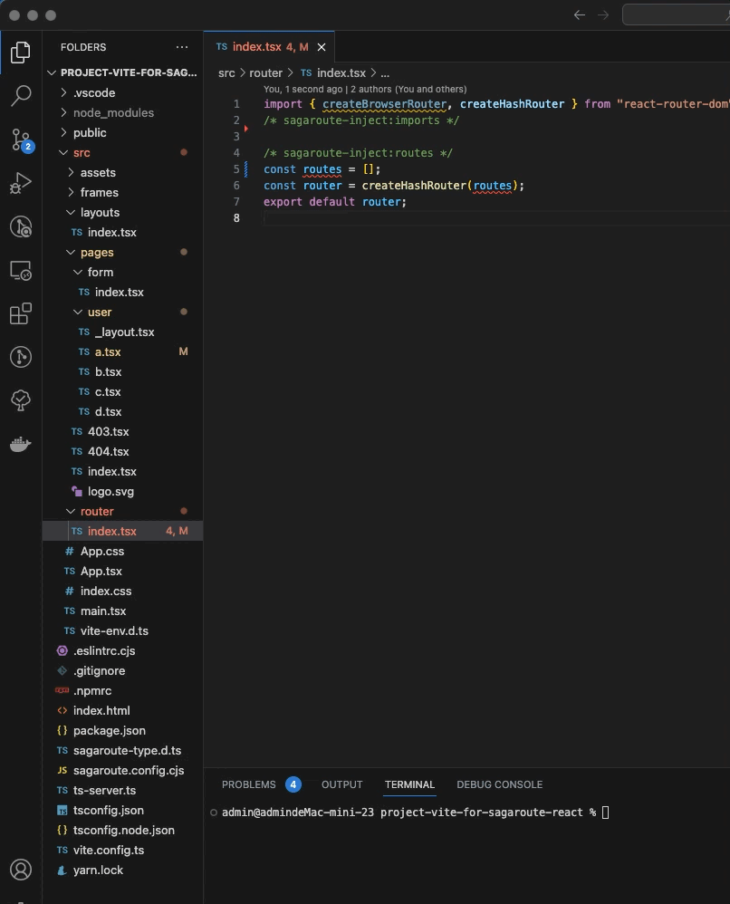

# @sagaroute/cmd

## 介绍

`@sagaroute/cmd`是一个基于[`@sagaroute/react`](../react/README.md)开发的进行快速生成约定式路由列表的命令行工具。

<p align="center">
    
</p>

## 特点

- 🌴 广泛性: 生成的**约定式路由列表**遵循`ES6 Module`格式，适用于任何开发环境
- 🎉 可扩展: 内部具有完整的执行周期，可通过[配置项](#配置)进行扩展
- 📲 实用性: 采用近似于[`umi`](https://v3.umijs.org/zh-CN/docs/convention-routing)的[约定式路由规则](../react/doc/Routing.md)，更贴近实际开发场景

## 起步

### 1. 安装

```bash
npm install -g  @sagaroute/cmd
# OR
yarn global add @sagaroute/cmd
```

### 2. 在路由模板文件中用注释做标记注入

[**路由模板文件**](../react/doc/Template.md)是指要被注入路由列表的文件，我们需要通过注释来指明**路由模板文件**中哪个位置被注入**路由列表**和**依赖**。

例如存在**路由模板文件**，其内容如下：

```js
import React from 'react';

const routes = [];
const router = createBrowserRouter(routes);
export default router;
```

我们需要对上述文件用注释进行标记，标记后如下所示：

```js
import React from 'react';
import { createBrowserRouter } from 'react-router-dom';
/* sagaroute-inject:imports */

/* sagaroute-inject:routes */
const routes = [];
const router = createBrowserRouter(routes);
export default router;
```

其中`/* sagaroute-inject:imports */`用于标记**依赖**注入的位置，`/* sagaroute-inject:routes */`用于标记**路由列表**注入的位置。关于这些注释的含义和**路由模板文件**的更多说明可看[此处](../react/doc/Routing.md)

### 3. 生成约定式路由列表

打开`terminal`终端，输入`sagaroute`命令运行后，会生成**路由列表**且将其插入到**路由模板文件**的指定位置上。

## 配置

### 配置参数

`@sagaroute/cmd`中支持指定的配置项如下所示：

配置项中所有参数的简要说明如下所示：

| 名称 | 说明 | 类型 | 默认值 |
| --- | --- | --- | --- |
| [dirpath](../react/doc/API.md#dirpath) | **页面文件目录**路径 | string | 'src/pages' |
| [layoutDirPath](../react/doc/API.md#layoutdirpath) | 全局路由目录路径 | string | 'src/layouts' |
| [routeFilePath](../react/doc/API.md#routeFilePath) | 指定路由模板文件的路径 | string | 'src/route.tsx' |
| [lazy](../react/doc/API.md#lazy) | 路由是否懒加载 | boolean/Function(string): boolean | false |
| [hooks](../react/doc/API.md#hooks) | 执行周期的钩子函数 | object | -- |
| [pathRewrite](../react/doc/API.md#pathRewrite) | 用于对 import 语句的路径进行替换 | Object{string: string} | -- |
| [rootPath](../react/doc/API.md#rootPath) | 项目路径 | string | process.cwd() |
| [onWarning](./doc/API.md#onwarning) | 触发警告时的回调函数 | function(message: string): void | -- |

对上述配置参数中更详细的说明可看[API](../react/doc/API.md)

### 配置设置方式

#### 1. 运行`sagaroute`命令行时指定参数

如下：

```bash
# 指定 页面文件目录 和 路由模板文件 的路径
sagaroute --dirpath=src/views --routeFilePath=src/router/index.jsx
```

#### 2. 在配置文件中指定参数

往项目中添加`sagaroute.config.js`或`sagaroute.config.cjs`作为配置文件，在文件中以`CommonJS`的格式编写和导出部分上述[配置项](#配置参数)，例如：

```js
module.exports = {
  // 指定页面文件目录
  dirpath: 'src/views',
  // 指定路由模板文件
  routeFilePath: 'src/router/index.jsx',
};
```

## 更多资料

- [约定式路由规则](../react/doc/Routing.md)
- [配置项 API 说明](../react/doc/API.md)
- [钩子函数](../react/doc/Hook.md)
- [路由模板文件](../react/doc/Template.md)
