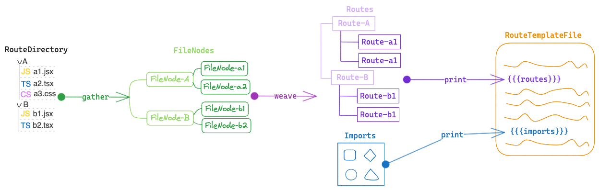

# @sagaroute/react

一款根据约定式[路由规则](./doc/Routing.md)生成路由列表的插件，生成的路由列表可直接用于[`react-router@6+`](https://github.com/remix-run/react-router)中。

## 快速上手

### 1. 安装

```bash
npm install @sagaroute/react
```

### 2. 在路由模板文件中用注释做标记注入

[**路由模板文件**](./doc/Template.md)是指要被注入路由列表的文件，我们需要通过注释来指明**路由模板文件**中哪个位置被注入**路由列表**和**依赖**。

例如存在**路由模板文件**，其内容如下：

```js
import React from 'react';

const routes = [];
const router = createBrowserRouter(routes);
export default router;
```

我们需要对上述文件用注释进行标记，标记后如下所示：

```js
import React from 'react';
import { createBrowserRouter } from 'react-router-dom';
/* sagaroute-inject:imports */

/* sagaroute-inject:routes */
const routes = [];
const router = createBrowserRouter(routes);
export default router;
```

其中`/* sagaroute-inject:imports */`用于标记**依赖**注入的位置，`/* sagaroute-inject:routes */`用于标记**路由列表**注入的位置。关于这些注释的含义和**路由模板文件**的更多说明可看[此处](./doc/Template.md)

### 3. 生成且注入路由

```js
import SagaRoute from '@sagaroute/react';

const sagaRoute = new SagaRoute({
  // 指定页面文件目录，默认为src/pages
  dirpath: 'src/views',
  // 指定路由模板文件，默认为src/routes.tsx
  routeFilePath: 'src/router/index.jsx',
});

// 调用routing后，sagaroute会扫描页面文件目录且生成路由列表，把路由列表注入到路由文件中
sagaRoute.routing();
```

最后经注入后的`"src/router/index.js"`的内容如下所示：

```jsx
import React from 'react';
import { createBrowserRouter } from 'react-router-dom';
/* sagaroute-inject:imports */
/* injected by sagaroute: start */
import PagesIndex from '../pages/index.jsx';
/* injected by sagaroute: end */

/* sagaroute-inject:routes */
const routes = [
  {
    path: '/',
    element: <PagesIndex />,
  },
];
const router = createBrowserRouter(routes);
export default router;
```

## 约定式路由规则

本插件的约定式路由规则的设计主要参考[`umi`](https://v3.umijs.org/zh-CN/docs/convention-routing)和[`next`](https://nextjs.org/docs/pages/building-your-application/routing)，关于路由规则的详细可看[约定式路由规则](./doc/Routing.md)

## 配置介绍

可以在初始化`@sagaroute/react`实例时，传入配置项，如下所示：

```js
import SagaRoute from '@sagaroute/react';

const sagaroute = new Sagaroute({
  dirpath: 'src/views',
});
```

配置项类型如下所示：

```ts
interface RoutingOption {
  rootPath?: string;
  dirpath?: string;
  layoutDirPath?: string;
  routeFilePath?: string;
  lazy?: boolean | LazyFn;
  pathRewrite?: Record<string, string>;
  onWarning?: (message: string) => void;
  hooks?: {
    build?: {
      before?: Handler<HookBeforeBuild>;
      after?: Handler<HookAfterBuild>;
    };
    gather?: {
      before?: Handler<GatherHookBefore>;
      beforeEach?: Handler<GatherHookBeforeEach>;
      afterEach?: Handler<GatherHookAfterEach>;
      after?: Handler<GatherHookAfter>;
    };
    weave?: {
      before?: Handler<WeaveHookBefore>;
      beforeEach?: Handler<WeaveHookBeforeEach>;
      afterEach?: Handler<WeaveHookAfterEach>;
      after?: Handler<WeaveHookAfter>;
    };
    print?: {
      parse?: {
        before?: Handler<PrintHookBeforeParse>;
        after?: Handler<PrintHookAfterParse>;
      };
      inject?: {
        before?: Handler<PrintHookBeforeInject>;
        after?: Handler<PrintHookAfterInject>;
      };
      write?: {
        before?: Handler<PrintHookBeforeWrite>;
        after?: Handler<PrintHookAfterWrite>;
      };
    };
  };
}
```

配置项中所有参数的简要说明如下所示：

| 名称 | 说明 | 类型 | 默认值 |
| --- | --- | --- | --- |
| [dirpath](./doc/API.md#dirpath) | **页面文件目录**路径 | string | 'src/pages' |
| [layoutDirPath](./doc/API.md#layoutdirpath) | 全局路由目录路径 | string | 'src/layouts' |
| [routeFilePath](./doc/API.md#routeFilePath) | 指定路由模板文件的路径 | string | 'src/route.tsx' |
| [lazy](./doc/API.md#lazy) | 路由是否懒加载 | boolean/Function(string): boolean | false |
| [hooks](./doc/API.md#hooks) | 执行周期的钩子函数 | object | -- |
| [pathRewrite](./doc/API.md#pathRewrite) | 用于对 import 语句的路径进行替换 | Object{string: string} | -- |
| [rootPath](./doc/API.md#rootPath) | 项目路径 | string | process.cwd() |
| [onWarning](./doc/API.md#onwarning) | 触发警告时的回调函数 | function(message: string): void | -- |

对上述配置参数中更详细的说明可看[API](./doc/API.md)

## 配置文件

支持往项目中添加`sagaroute.config.js`或`sagaroute.config.cjs`作为配置文件，在文件中以`CommonJS`的格式编写和导出部分上述[配置项](#配置介绍)，例如：

```js
module.exports = {
  lazy: function (filepath) {
    return filepath.includes('charts');
  },
};
```

## 深入原理: 三个阶段

`@sagaroute/react`从生成路由列表到将其插入到**路由模板文件**的整个过程中需要经历三个的执行阶段，分别是`gather`、`weave`和`print`，其分布图如下所示：

<p align="center">
    
</p>

### gather

`gather`阶段会遍历**路由文件目录**下的所有文件，根据[约定式路由规则](./Routing.md)过滤出符合条件的文件，并把每个符合条件的 **文件对象（即包括文件和文件夹）** 转换成`FileNode`节点，最后组成`FileNodes`列表。

`FileNode`的类型如下所示：

```ts
interface FileNode {
  name: string;
  children?: FileNode[];
  type: 'dir' | 'file';
  layoutNode?: boolean;
  props?: {
    routeProps?: Record<string, any>;
    routeOptions?: {
      layout?: boolean;
      [key: string]: any;
    };
  };
  path: string;
  dependencies?: Dependency[];
}
```

参数解释：

- `name`: 节点对应的**文件对象**名称
- `children`: 如果节点对应文件夹，则`children`为该文件夹下的**文件对象**转换后的节点列表
- `type`: `dir`代表**文件对象**为文件夹，`file`代表文件对象为文件
- `layoutNode`: 代表**文件对象**是否为**全局路由文件**
- `props`: 包含文件中导出的与路由相关的两个属性[routeProps](./Routing.md/#routeprops)和[routeOptions](./Routing.md#routeoptions)
- `path`: 文件对象的绝对路径
- `dependencies`: `props`中包含的属性所附带的依赖

### weave

`weave`阶段会遍历`gather`生成的`FileNode`数组，根据`react-router`的规则`Routes`生成路由列表和`Routes`的依赖集合`Imports`。

`Routes`的类型等同于`react-router`的[`RouteObject`](https://reactrouter.com/en/main/route/route#type-declaration)类型，如下所示：

```ts
interface RouteObject {
  path?: string;
  index?: boolean;
  children?: React.ReactNode;
  caseSensitive?: boolean;
  id?: string;
  loader?: LoaderFunction;
  action?: ActionFunction;
  element?: React.ReactNode | null;
  Component?: React.ComponentType | null;
  errorElement?: React.ReactNode | null;
  ErrorBoundary?: React.ComponentType | null;
  handle?: RouteObject['handle'];
  shouldRevalidate?: ShouldRevalidateFunction;
  lazy?: LazyRouteFunction<RouteObject>;
}
```

### print

`print`阶段会把`weave`生成的`Routes`和`Imports`作为**模板变量**插入到**路由模板文件**对应的位置上，从而完成注册路由从扫描、生成到覆写的过程。关于**路由模板文件**的解释可看[此处](./doc/Routing.md)。

### 钩子函数

`gather`、`weave`、`print`三个阶段都可以注册钩子函数去调整整个路由列表生成的过程，详细可看[钩子函数](./doc/Hook.md)。
