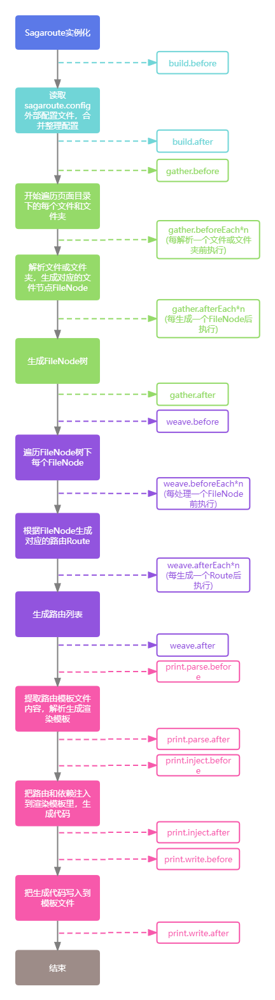

## 钩子函数

**阅读本章节前需要先了解`@sagaroute/react`经历的三个执行阶段，详情可查看[深入原理: 三个阶段](../README.md#深入原理-三个阶段)**。

`@sagaroute/react`实例在创建到生成路由列表都需要经历一系列的步骤，比如获取合并配置、生成 `FileNode` 列表、生成路由列表、注入路由列表。在此过程中，它会运行注册在某个步骤下的钩子函数，让开发者由机会在该步骤中运行自己的代码去更改每个阶段生成的结果，以及决定是否终止流程的执行。

### 注册钩子函数

举例来说，`weave.afterEach`会在单个路由生成后运行，那么，我们可以通过代码使路由路径从驼峰式命名（如`RoleList`）换成小写横杠分割命名（如`role-list`），如下所示：

```ts
new Sagaroute({
  hooks: {
    weave: {
      afterEach(route) {
        route.path = route.path
          ?.replace(/([A-Z])/g, "-$1")
          .replace(/^-/, "")
          .toLocaleLowerCase();
      },
    },
  },
});
```

还有其他的钩子，会在实例初始化或执行时的不同阶段被调用，最常用的是[`weave.beforeEach`](#weavebeforeeach)和[`gather.beforeEach`](#gatherbeforeeach)。所有的钩子函数的完整参考及其用法请参考[钩子函数 API 介绍](#api-介绍)。

### 钩子函数执行阶段图示

下面是实例初始化和执行的图表，其中包含所有在不同步骤前后执行的钩子函数。你现在并不需要完全理解图中的所有内容，但以后它将是一个有用的参考。

<p align="center">
    
</p>

有关所有钩子函数及其各自用例的详细信息，请看[钩子函数 API 介绍](#api-介绍)。

### API 介绍

#### build.before

- 执行阶段：在`Sagaroute`实例初始化时，读取[配置文件](../README.md/#配置文件)，获取和整理配置前执行。
- 类型
  ```ts
  /**
   * @param {RoutingOption} inputOption SagaRoute实例化时传入的配置参数
   * @returns {void|UltimateRoutingOption} 如果返回了结果，该结果将会作为最终的配置，且跳过读取配置文件、合并配置、格式化配置的步骤
   */
  function buildbBefore(
    inputOption: RoutingOption
  ): void | UltimateRoutingOption;
  ```
- 示例

  ```ts
  const sagaroute = new Sagaroute({
    dirpath: "src/views",
    hooks: {
      build: {
        before(option) {
          console.log(option);
        },
      },
    },
  });

  /**
   * 打印输出：
   * {
   *  dirpath: 'src/views',
   *  hooks:{
   *      build:{
   *          before: 'fn'
   *      }
   *  }
   * }
   */
  ```

#### build.after

- 执行阶段：在实例`Sagaroute`实例初始化时，完成读取[配置文件](../README.md/#配置文件)以及整理配置后执行。
- 类型
  ```ts
  /**
   * @param {UltimateRoutingOption} ultimateOption UltimateRoutingOption类型是整理后的配置格式，与传入的配置的类型RoutingOption稍有不同
   */
  function buildAfter(ultimateOption: UltimateRoutingOption): void;
  ```

#### gather.before

- 执行阶段：在`Sagaroute`实例开始遍历**路由文件目录**前执行。
- 类型：
  ```ts
  /**
   * @param {string} dirpath 路由文件目录路径
   * @param {string} layoutDirPath 全局路由目录路径
   * @returns {void|null} 如果返回值为null，则执行流程在此终止
   */
  function gatherBefore(dirpath: string,layoutDirPath: string) => void | null;
  ```

#### gather.beforeEach

- 执行阶段：在`Sagaroute`实例遍历**路由文件目录**过程中，解析每个 **文件节点（即文件和文件夹）** 之前执行。
- 类型：
  ```ts
  /**
   * @param {string} fpath 当前准备解析的文件节点的路径
   * @returns {void|FileNode|null}
   *    1. 如果返回的是FileNode，会直接跳过解析步骤且把FileNode作为结果纳入FileNode列表上
   *    2. 如果返回的是null，则终止对当前文件节点的解析，但不影响对其他文件节点的解析，且不会执行该文件节点的gather.afterEach钩子函数
   */
  function gatherBeforeEach(fpath: string): void | FileNode | null;
  ```
- 示例：如果要实现特定名称的文件夹下的文件不会被解析成路由，可借此钩子函数实现
  ```ts
  new Sagaroute({
    hooks: {
      gather: {
        beforeEach(fpath) {
          // widgets文件夹下的文件不会被解析
          if (fpath.includes("/widgets/")) {
            return null;
          }
        },
      },
    },
  });
  ```

#### gather.afterEach

- 执行阶段：在`Sagaroute`实例遍历**路由文件目录**过程中，解析每个文件节点生成`FileNode`后执行。
- 类型：
  ```ts
  /**
   * @param {FileNode} fileNode 解析当前文件节点后生成的FileNode
   * @param {string} dirpath 路由文件目录路径
   * @param {string} layoutDirPath 全局路由目录路径
   * @returns {void}
   */
  function gatherAfterEach(fileNode: FileNode, fpath: string): void;
  ```

#### gather.after

- 执行阶段：在`Sagaroute`实例完成遍历**路由文件目录**且生成`FileNode`列表后执行
- 类型：
  ```ts
  /**
   * @param {FileNode[]} fileNodes 解析后生成的FileNode列表
   * @param {string} dirpath 路由文件目录路径
   * @param {string} layoutDirPath 全局路由目录路径
   * @returns {void}
   */
  function gatherAfter(fileNode: FileNode, fpath: string): void;
  ```

#### weave.before

- 执行阶段：在`Sagaroute`实例准备遍历`FileNode`列表以生成路由列表之前执行
- 类型：
  ```ts
  /**
   * @param {FileNode[]} fileNodes 准备要遍历的FileNode列表
   * @returns {void|null} 如果返回值为null，则执行流程在此终止
   */
  function weaveBefore(fileNodes: FileNode[]): void | null;
  ```

#### weave.beforeEach

- 执行阶段：在`Sagaroute`实例根据当前遍历到的`FileNode`生成路由之前执行
- 类型：
  ```ts
  /**
   * @typedef  FileNodeParent
   * @type {object}
   * @property {string} path - 父节点的路径
   * @property {string} layoutNode - 父节点是否为全局路由对应的FileNode
   *
   * @param {FileNode} fileNode 当前遍历到的FileNode
   * @param {FileNodeParent} parent 当前遍历到的FileNode的父节点信息
   * @returns {void|Object|null}
   *    1. 如果返回Object{ route: RouteObject; imports: Imports }，则，会直接跳过生成路由步骤且把route作为结果纳入路由列表里，imports会作为依赖之一合并到依赖表中
   *    2. 如果返回的是null，则终止生成对应当前FileNode的路由，但不影响对其他FileNode的路由的生成。且不会执行该FileNode对应的weave.afterEach钩子函数
   */
  function weaveBeforeEach(
    fileNode: FileNode,
    parent: FileNodeParent
  ): void | { route: RouteObject; imports: Imports } | null;
  ```
- 示例：如果要实现特定名称的文件夹下的文件不会被解析成路由，除了[gather.beforeEach](#gatherbeforeeach)，也可借助此钩子函数实现：

  ```ts
  new Sagaroute({
    hooks: {
      weave: {
        beforeEach(fileNode) {
          if (fileNode.path.includes("/widgets/")) {
            return null;
          }
        },
      },
    },
  });
  ```

#### weave.afterEach

- 执行阶段：在`Sagaroute`实例根据当前遍历到的`FileNode`生成路由之后执行
- 类型：
  ```ts
  /**
   * @param {RouteObject} route 根据当前遍历到的FileNode生成的路由
   * @param {Imports} imports 当前路由所附带的依赖集合
   * @param {FileNode} fileNode 当前遍历到的FileNode
   * @param {FileNodeParent} parent 当前遍历到的FileNode的父节点信息
   */
  function weaveAfterEach(
    route: RouteObject,
    imports: Imports,
    fileNode: FileNode,
    parent: FileNodeParent
  ): void;
  ```
- 示例：

  1. 如果想要把所有的路由路径从驼峰式命名（如`RoleList`）换成小写横杠分割命名（如`role-list`），可以借助该钩子函数实现，如下所示：

     ```js
     new Sagaroute({
       hooks: {
         weave: {
           afterEach(route) {
             route.path = route.path
               ?.replace(/([A-Z])/g, "-$1")
               .replace(/^-/, "")
               .toLocaleLowerCase();
           },
         },
       },
     });
     ```

  2. 如果要指定所有路由的匹配规则都遵循大小写敏感，既把所有的`route.caseSensitive`设为`true`，可以借助该钩子函数实现，如下所示：

     ```js
     new Sagaroute({
       hooks: {
         weave: {
           afterEach(route) {
             route.path = route.path
               ?.replace(/([A-Z])/g, "-$1")
               .replace(/^-/, "")
               .toLocaleLowerCase();
           },
         },
       },
     });
     ```

#### weave.after

- 执行阶段：在`Sagaroute`实例生成路由列表后执行
- 类型：
  ```ts
  /**
   * @param {RouteObject[]} routes 生成的路由列表
   * @param {Imports} imports 生成的路由列表所附带的依赖集合
   * @param {FileNode[]} fileNodes 遍历到的FileNode列表
   */
  function weaveAfter(
    routes: RouteObject[],
    imports: Imports,
    fileNodes: FileNode[]
  ): void;
  ```

#### print.parse.before

- 执行阶段：在对**路由模板文件**进行解析生成渲染模板之前执行
- 类型：
  ```ts
  /**
   * @param {string} routeFilePath 路由模板文件的路径
   * @returns {void|string|null}
   *    1. 如果返回字符串，则直接跳过解析生成渲染模板步骤且把返回结果作为渲染模板
   *    2. 如果返回的是null，则执行流程在此终止
   */
  function printParseBefore(routeFilePath: string): void | string | null;
  ```
- 示例：如果项目中存在自定义的渲染模板，且不想用**路由模板文件**，则可借助该钩子函数实现：

  ```ts
  new Sagaroute({
    hooks: {
      print: {
        parse: {
          before(routeFilePath) {
            // 读取返回渲染模板内容
            return fs.readFileSync(
              path.join(__dirname, "template.txt"),
              "utf-8"
            );
          },
        },
      },
    },
  });
  ```

#### print.parse.after

- 执行阶段：在对**路由模板文件**进行解析生成渲染模板之前执行
- 类型：
  ```ts
  /**
   * @param {string} template 渲染模板
   * @param {string} routeFilePath 路由模板文件路径
   */
  function printParseAfter(template: string, routeFilePath: string): void;
  ```

#### print.inject.before

- 执行阶段：在把含路由列表和依赖集合的**模板变量**渲染到渲染模板上之前执行
- 类型：
  ```ts
  /**
   * @param {Object{string: any}} view 模板变量
   * @param {string} template 渲染模板
   * @param {RouteObject[]} routes 路由列表
   * @returns {void | string | null}
   *    1. 如果返回结果为string，则跳过把模板变量渲染到渲染模板的步骤，且把返回结果当作渲染结果
   *    2. 如果返回的是null，则执行流程在此终止
   */
  function printInjectBefore(
    view: Record<string, any>,
    template: string,
    routes: RouteObject[]
  ): void | string | null;
  ```
- 示例：如果想把路由列表分割到两个路由变量上，可借助该钩子函数实现：

  假设存在**路由文件目录**，结构如下所示：

  ````bash
  ```bash
  └── pages
      ├── user
      │   ├── index.tsx
      │   └── comments.tsx
      └── echart
          ├── line.tsx
          └── pie.tsx
  ````

  如果要实现**user**和**echart**文件夹生成的注册路由分开放在以下**路由模板文件**里的两个变量`chartRoutes`和`userRoutes`里：

  ```js
  /* sagaroute-inject:userRoutes */
  export const userRoutes = [];
  /* sagaroute-inject:chartRoutes */
  export const chartRoutes = [];
  ```

  则可以借助该钩子函数实现：

  ```ts
  import { transformRoutesToString } from "@sagaroute/react";

  new Sagaroute({
    hooks: {
      print: {
        inject: {
          before(view, template, routes) {
            // 往模板变量view里新增userRoutes和chartRoutes变量
            // transformRoutesToString方法用于把路由列表转换为可渲染到渲染模板上的字符串
            view["userRoutes"] = transformRoutesToString(
              routes.filter((item: any) => item.path === "user")
            );
            view["chartRoutes"] = transformRoutesToString(
              routes.filter((item: any) => item.path === "chart")
            );
          },
        },
      },
    },
  });
  ```

  经过上述代码后便可实现路由分割。

#### print.inject.after

- 执行阶段：在把**模板变量**渲染到**渲染模板**以生成**渲染结果**后执行。
- 类型：
  ```ts
  /**
   * @param {string} content 渲染后生成的渲染结果
   * @param {Object{string: any}} view 模板变量
   * @param {string} template 渲染模板
   */
  function printInjectAfter(
    content: string,
    view: Record<string, any>,
    template: string
  ): void;
  ```

#### print.write.before

- 执行阶段：在把**渲染结果**覆写在**路由模板文件**之前执行。
- 类型：

  ```ts
  /**
   * @param {string} renderedContent 渲染后生成的渲染结果
   * @param {string} routeFilePath 路由模板文件的路径
   * @returns {void | null} 如果返回的是null，则执行流程在此终止
   */
  function printWriteBefore(
    renderedContent: string,
    routeFilePath: string
  ): void | null;
  ```

#### print.write.after

- 执行阶段：在把**渲染结果**覆写在**路由模板文件**之后执行。
- 类型：

  ```ts
  /**
   * @param {string} routeFilePath 路由模板文件的路径
   */
  function printWriteAfter(routeFilePath: string): void;
  ```

---

注意：除了`build.before`外，所有阶段的`before`和`beforeEach`钩子函数都可以通过返回`null`值来终止流程的执行。

### 多个钩子函数与执行顺序

每个钩子都支持传入数组以支持多个钩子函数的存在，如：

```js
new Sagaroute({
  hooks: {
    weave: {
      afterEach: [function fn1() {}, function fn2() {}],
    },
  },
});
```

传入的钩子函数在执行的时候**是串行、同步且默认无序**的，**如果存在多个带返回结果的钩子函数，那么默认以最后一个带返回结果的钩子函数返回的结果为准**。那么问题来了，既然无序，那怎么确定哪个钩子函数是最后一个执行的？

其实每个钩子都可以定义执行顺序，我们可以用传入一个对象来定义钩子函数的执行顺序，如下所示：

```js
new Sagaroute({
  hooks: {
    weave: {
      afterEach: [
        { order: 1, handler: function fn1() {} },
        { order: 2, handler: function fn2() {} },
      ],
    },
  },
});
```

对象中的`order`代表钩子函数的执行顺序，`handler`代表钩子函数自身。`order`越小越先执行，例如上述代码中的`fn1`会比`fn2`早执行，如果直接传入钩子函数而不是对象，则默认该钩子函数的`order`为`50`。

`order`原则上是`number`值，因此可传入任意数字，`@sagaroute/react`中建议用户设立的`order`值范围为`0~100`，其余的数字值供开发插件使用。
