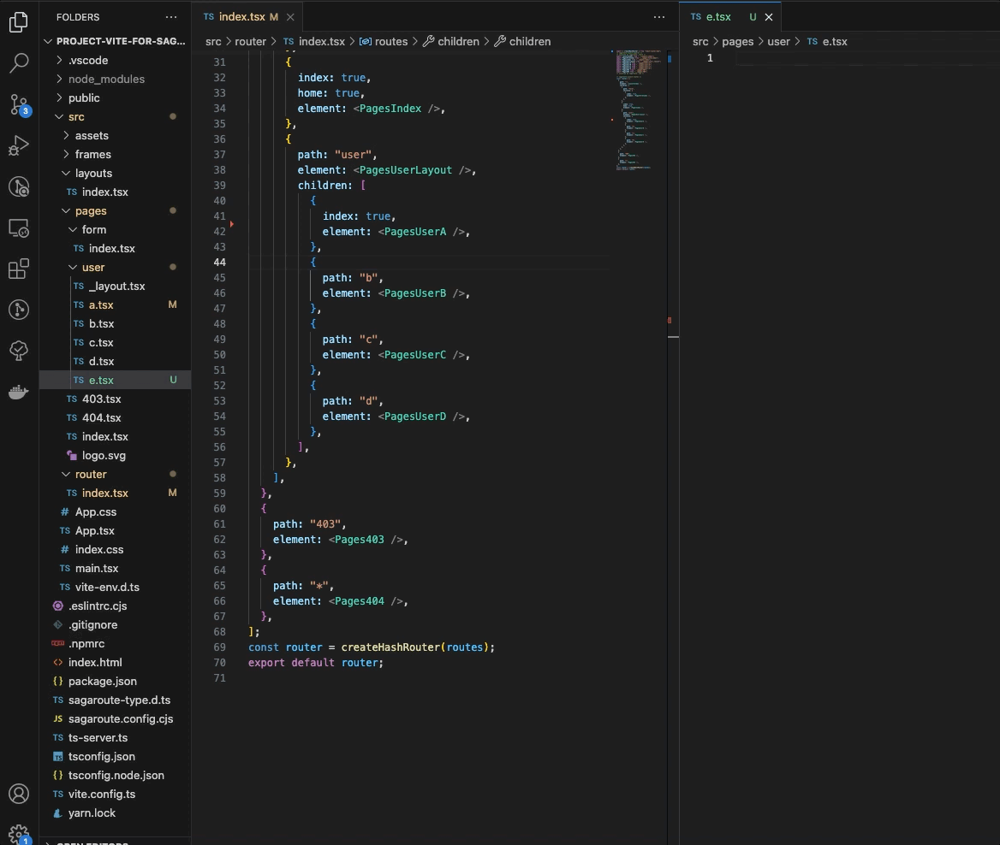
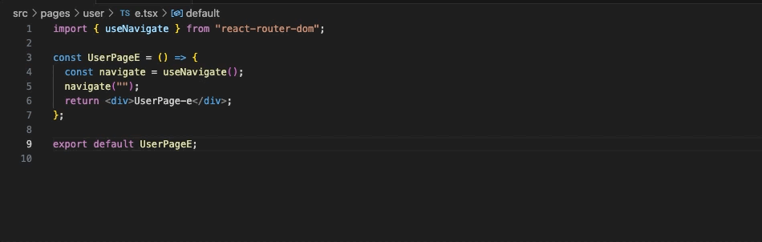
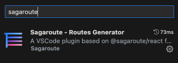
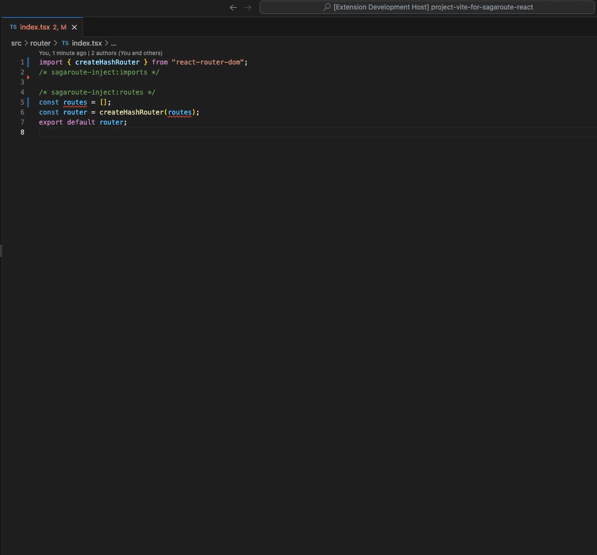
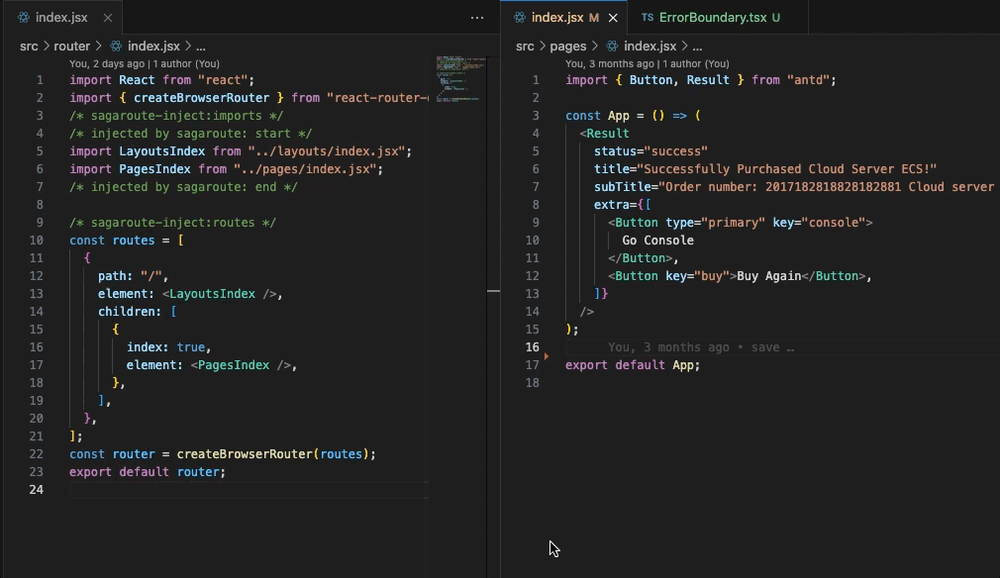
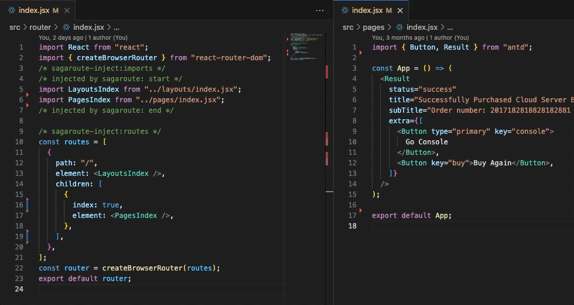

# sagaroute-vscode

 

**❗注意: 在`vscode extension marketplace`中该文档会存在图片和链接不能查看的情况，请前往[github](https://github.com/Hitotsubashi/sagaroute/tree/main/packages/vscode-ext)或[gitee](https://gitee.com/Hitotsubashi/sagaroute/tree/main/packages/vscode-ext)进行阅读**

## 介绍

`sagaroute-vscode`是一款基于`@sagaroute/react`开发的用于快速生成约定式路由列表的`VSCode`插件，它会监听**路由文件目录**的变化以动态生成约定式路由列表，并把生成结果插入到指定[**路由模板文件**](../react/doc/Template.md)

<p align="center">
    
    <div align="center">文件变化后触发路由列表更新</div>
</p>

<p align="center">
    
    <div align="center">支持智能提示路由路径</div>
</p>

## 特点

- 🌴 泛用性: 生成的**约定式路由列表**遵循`ES6 Module`格式，适用于任何开发环境
- 🎯 智能提示: 具有路由路径智能提示机制
- 🚀 快且稳: 合理利用[缓存机制](#缓存)，使第二次的生成速度更快。若生成结果与上次相同，则不会更改**路由模板文件**
- 📲 实用性: 采用近似于[`umi`](https://v3.umijs.org/zh-CN/docs/convention-routing)的[约定式路由规则](../react/doc/Routing.md)，更贴近实际开发场景
- 📇 样式一致: 生成**路由列表**保存后会自动触发代码风格约束插件的格式化(如`prettier`、`eslint`，取决于`vscode`安装了哪些插件)
- 🎉 可扩展: 支持[配置文件](../react/README.md#配置文件)，可通过钩子函数控制工作流程或增强路由对象

## 使用

### 1. 安装插件

从`vscode`的`EXTENSTIONS: MARKETPLACE`中下载，如下所示👇：



### 2. 在项目中下载`@sagaroute/react`(非必须但推荐)

```bash
npm install @sagaroute/react
```

**_与`prettier-vscode`一样，在`sagaroute-vscode`中有内嵌的`@sagaroute/react`，因此即使不做这一步也不会影响运行。但这里推荐做做这一步是因为这样确保不同开发者在同一项目中使用的`@sagaroute/react`的版本是一致的，避免因版本不同导致的差异化情况_**

**执行该步骤后需要重启`Vscode`才会生效**

### 3. 在路由模板文件中用注释做标记注入

[**路由模板文件**](../react/doc/Template.md)是指要被注入路由列表的文件，我们需要通过注释来指明**路由模板文件**中哪个位置被注入**路由列表**和**依赖**

例如存在**路由模板文件**，其内容如下：

```js
import React from 'react';

const routes = [];
const router = createBrowserRouter(routes);
export default router;
```

我们需要对上述文件用注释进行标记，标记后如下所示：

```js
import React from 'react';
import { createBrowserRouter } from 'react-router-dom';
/* sagaroute-inject:imports */

/* sagaroute-inject:routes */
const routes = [];
const router = createBrowserRouter(routes);
export default router;
```

其中`/* sagaroute-inject:imports */`用于标记**依赖**注入的位置，`/* sagaroute-inject:routes */`用于标记**路由列表**注入的位置。关于这些注释的含义和**路由模板文件**的更多说明可看[此处](../react/doc/Routing.md)

### 4. 生成路由列表

`@sagaorute/vscode-extension`会监听**页面文件目录**里的文件，当更改的文件`CRTL+S`保存时开始执行生成路由，同时你也可以使用命令要求本插件开始生成路由，即(CMD/CTRL + Shift + P)唤出命令面板后输入`Sagaroute: routing`，如下 👇 所示：

<p align="center">
    
</p>

## 支持设置路由属性

你可以在组件的[`routeProps`](../react/doc/Routing.md#routeprops)字段中设置属性，`routeProps`上的所有属性会复制到**注册路由**上：

假如存在`src/pages/users.tsx`文件，其文件内容如下所示：

```jsx
import ErrorBoundary from '@/components/ErrorBoundary';

export default function Users() {
  return <div>Users...</div>;
}

// 设置routeProps
/** @type {import('react-router-dom').RouteObject} */
Users.routeProps = {
  caseSensitive: false,
};
```

生成的注册路由如下所示：

```jsx
{
  path:'user',
  element:<PagesUsers/>,
  caseSensitive: false,
  ErrorBoundary: ComponentsErrorBoundary
}
```

可看以下效果图：



`routeProps`属性的设置值支持任意类型，不过要遵循编码规则，详情请看[此处](../react/doc/Routing.md#routeprops)

## 配置参数

`@sagaroute/cmd`中支持指定的配置项如下所示：

配置项中所有参数的简要说明如下所示：

| 名称 | 说明 | 类型 | 默认值 |
| --- | --- | --- | --- |
| [dirpath](../react/doc/API.md#dirpath) | **页面文件目录**路径 | string | 'src/pages' |
| [layoutDirPath](../react/doc/API.md#layoutdirpath) | 全局路由目录路径 | string | 'src/layouts' |
| [routeFilePath](../react/doc/API.md#routeFilePath) | 指定路由模板文件的路径 | string | 'src/route.tsx' |
| [lazy](../react/doc/API.md#lazy) | 路由是否懒加载 | boolean/Function(string): boolean | false |
| [hooks](../react/doc/API.md#hooks) | 执行周期的钩子函数 | object | -- |
| [pathRewrite](../react/doc/API.md#pathRewrite) | 用于对 import 语句的路径进行替换 | Object{string: string} | -- |
| [rootPath](../react/doc/API.md#rootPath) | 项目路径 | string | process.cwd() |
| [onWarning](./doc/API.md#onwarning) | 触发警告时的回调函数 | function(message: string): void | -- |

**注意❗：在该插件中，`hooks`的[`print.inject.after`](../react/doc/Hook.md#printinjectafter)、[`print.write.before`](../react/doc/Hook.md#printwritebefore)、[`print.write.after`](../react/doc/Hook.md#printwriteafter)不会被执行。**

对上述配置参数中更详细的说明可看[API](../react/doc/API.md)

### 配置设置方式

往项目中添加`sagaroute.config.js`或`sagaroute.config.cjs`作为配置文件，在文件中以`CommonJS`的格式编写和导出部分上述[配置项](#配置参数)，例如：

```js
/** @type {import('@sagaroute/react').RoutingOption} */
module.exports = {
  // 指定页面文件目录
  dirpath: 'src/views',
  // 指定路由模板文件
  routeFilePath: 'src/router/index.jsx',
};
```

## 命令

`sagaroute-vscode`提供了以下命令，可通过(CMD/CTRL + Shift + P)唤出命令面板后输入使用：

- `Sagaroute: routing`: 生成路由列表，若存在缓存，则无视缓存重新构建
- `Sagaroute: rebuild`: 重新根据[配置文件](#配置设置方式)构建配置，并执行生成路由列表的操作
- `Sagaroute: show`: 打开`Sagaroute`的`output`输出面板

## `.vscode/settings.json`中的`Sagaroute`设定

你可以在`.vscode/settings.json`中设置`sagaroute.working`变量，以决定`Sagaroute`是否开启监听**路由文件目录**的变化以动态生成约定式路由列表，如下所示：

```json
{
  // true代表开启监控
  "sagaroute.working": true
}
```

## 状态栏

在`vscode`底部的状态栏中会有`Sagaroute`的状态控件，以显示`Sagaroute`是否处于监听**路由文件目录**中。如下所示：

<p align="center">
    
    <div align="center">白字代表Sagaroute没有监听</div>
</p>

<p align="center">
    
    <div align="center">绿字代表Sagaroute正在监听</div>
</p>

你也可以通过点击该状态控件来切换监听状态。监听状态会同步到`.vscode/settings.json`的`sagaroute.working`变量中

## 高级特性

### 路由路径智能拼写

你可以在项目中通过键入`"//"`，`sagaroute`插件会提供所有所有路由的路径提示，如下所示：

<p align="center">
    
    <div align="center">支持智能提示路由路径</div>
</p>

选择后，`"//"`会被替换成所选择的路由路径

**注意：在`vscode`项目首次打开时，要先做保存操作或者强制`Sagaroute: routing`后，才会有开启路由路径智能拼写**

### 支持批量生成`lazy`路由

[`lazy`](https://reactrouter.com/en/main/route/lazy#lazy)是`react-router@6.4`新增的路由属性，用于路由文件的懒加载，`lazy`有多种写法，如下所示：

```js
[
  // 写法1: 只对路由文件进行懒加载
  {
    path: 'projects',
    loader: ({ request }) => fetchDataForUrl(request.url),
    lazy: () => import('./projects'),
  },
  // 写法2: 对路由文件及其路由属性变量进行懒加载
  {
    path: 'messages',
    async lazy() {
      let { messagesLoader, Messages } = await import('./pages/Dashboard');
      return {
        loader: messagesLoader,
        Component: Messages,
      };
    },
  },
];
```

本插件可以通过设置[`lazy`配置项](https://gitee.com/Hitotsubashi/sagaroute/blob/main/packages/react/doc/API.md#lazy)统一生成上述 👆 第 2 种写法的`lazy`路由，如下 👇 效果图：


### 缓存

本插件内部实现了路由对象的缓存机制，因此存在以下优点：

1. 加速二次生成路由的速度：对内容未更改的文件会直接取缓存作为生成结果，加快生成整个路由列表的生成速度
2. 只在路由列表变化时更新文件：对每个非缓存的新路由，会与缓存中的路由进行对比，如果所有对比结果与上次相同且没有增删的路由，则不会更改文件内容，避免频繁的热更新

可看以下👇效果图：

<p align="center">
  
  <div align="center">1. 生成路由与上次一致时，不会更改路由文件的内容</div>
</p>

<p align="center">
  
  <div align="center">2. 生成路由与上次不一致时，才会更改路由文件的内容</div>
</p>

若要无视缓存强制生成路由列表，则可使用[`Sagaroute: routing`命令](#命令)
