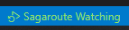

# @sagaroute/vscode-extension

## 介绍

`@sagaroute/vscode-extension`是一款基于`@sagaroute/react`开发的用于快速生成约定式路由列表的`VSCode`插件，它会监听**路由文件目录**的变化以动态生成约定式路由列表，并把生成结果插入到指定[**路由模板文件**](../react/doc/Template.md)

<p align="center">
    
    <div align="center">文件变化后触发路由列表更新</div>
</p>

<p align="center">
    
    <div align="center">支持智能提示路由路径</div>
</p>

## 特点

- 🌴 广泛性: 生成的**约定式路由列表**遵循`ES6 Module`格式，适用于任何开发环境
- 🎯 智能提示: 具有路由路径智能提示机制
- 🚀 快且稳: 合理利用缓存机制，使第二次的生成速度更快。若生成结果与上次相同，则不会更改**路由模板文件**
- 📲 实用性: 采用近似于[`umi`](https://v3.umijs.org/zh-CN/docs/convention-routing)的[约定式路由规则](../react/doc/Routing.md)，更贴近实际开发场景
- 📇 样式一致: 生成**路由列表**保存后会自动触发代码风格约束插件的格式化(如`prettier`、`eslint`，取决于`vscode`安装了哪些插件)
- 🎉 可扩展: 支持[配置文件](../react/README.md#配置文件)，可通过钩子函数控制工作流程或增强路由对象

## 使用

### 1. 安装插件

<!-- TODO：上传后才编写 -->

### 2. 在路由模板文件中用注释做标记注入

[**路由模板文件**](../react/doc/Template.md)是指要被注入路由列表的文件，我们需要通过注释来指明**路由模板文件**中哪个位置被注入**路由列表**和**依赖**

例如存在**路由模板文件**，其内容如下：

```js
import React from 'react';

const routes = [];
const router = createBrowserRouter(routes);
export default router;
```

我们需要对上述文件用注释进行标记，标记后如下所示：

```js
import React from 'react';
import { createBrowserRouter } from 'react-router-dom';
/* sagaroute-inject:imports */

/* sagaroute-inject:routes */
const routes = [];
const router = createBrowserRouter(routes);
export default router;
```

其中`/* sagaroute-inject:imports */`用于标记**依赖**注入的位置，`/* sagaroute-inject:routes */`用于标记**路由列表**注入的位置。关于这些注释的含义和**路由模板文件**的更多说明可看[此处](../react/doc/Routing.md)

### 3. 生成路由列表

`@sagaorute/vscode-extension`会监听**页面文件目录**里的文件，当文件变化时开始执行生成路由，同时你也可以使用命令要求本插件开始生成路由，即(CMD/CTRL + Shift + P)唤出命令面板后输入`Sagaroute: routing`，如下 👇 所示：

<p align="center">
    
</p>

## 路由路径智能拼写

你可以在项目中通过键入`"//"`，`sagaroute`插件会提供所有所有路由的路径提示，如下所示：

<p align="center">
    
    <div align="center">支持智能提示路由路径</div>
</p>

选择后，`"//"`会被替换成所选择的路由路径

**注意：在`vscode`项目首次打开时，要先做保存操作或者强制`Sagaroute: routing`后，才会有开启路由路径智能拼写**

### 配置参数

`@sagaroute/cmd`中支持指定的配置项如下所示：

配置项中所有参数的简要说明如下所示：

| 名称 | 说明 | 类型 | 默认值 |
| --- | --- | --- | --- |
| [dirpath](../react/doc/API.md#dirpath) | **页面文件目录**路径 | string | 'src/pages' |
| [layoutDirPath](../react/doc/API.md#layoutdirpath) | 全局路由目录路径 | string | 'src/layouts' |
| [routeFilePath](../react/doc/API.md#routeFilePath) | 指定路由模板文件的路径 | string | 'src/route.tsx' |
| [lazy](../react/doc/API.md#lazy) | 路由是否懒加载 | boolean/Function(string): boolean | false |
| [hooks](../react/doc/API.md#hooks) | 执行周期的钩子函数 | object | -- |
| [pathRewrite](../react/doc/API.md#pathRewrite) | 用于对 import 语句的路径进行替换 | Object{string: string} | -- |
| [rootPath](../react/doc/API.md#rootPath) | 项目路径 | string | process.cwd() |
| [onWarning](./doc/API.md#onwarning) | 触发警告时的回调函数 | function(message: string): void | -- |

对上述配置参数中更详细的说明可看[API](../react/doc/API.md)

### 配置设置方式

往项目中添加`sagaroute.config.js`或`sagaroute.config.cjs`作为配置文件，在文件中以`CommonJS`的格式编写和导出部分上述[配置项](#配置参数)，例如：

```js
module.exports = {
  // 指定页面文件目录
  dirpath: 'src/views',
  // 指定路由模板文件
  routeFilePath: 'src/router/index.jsx',
};
```

## 命令

`@sagaroute/vscode-extension`提供了以下命令，可通过(CMD/CTRL + Shift + P)唤出命令面板后输入使用：

- `Sagaroute: routing`: 生成路由列表，若存在缓存，则无视缓存重新构建
- `Sagaroute: rebuild`: 重新根据[配置文件](#配置设置方式)构建配置，并执行生成路由列表的操作
- `Sagaroute: show`: 打开`Sagaroute`的`output`输出面板

## `.vscode/settings.json`中的`Sagaroute`设定

你可以在`.vscode/settings.json`中设置`sagaroute.working`变量，以决定`Sagaroute`是否开启监听**路由文件目录**的变化以动态生成约定式路由列表，如下所示：

```json
{
  // true代表开启监控
  "sagaroute.working": true
}
```

## 状态栏

在`vscode`底部的状态栏中会有`Sagaroute`的状态控件，以显示`Sagaroute`是否处于监听**路由文件目录**中。如下所示：

<p align="center">
    
    <div align="center">白字代表Sagaroute没有监听</div>
</p>

<p align="center">
    
    <div align="center">绿字代表Sagaroute正在监听</div>
</p>

你也可以通过点击该状态控件来切换监听状态。监听状态会同步到`.vscode/settings.json`的`sagaroute.working`变量中
