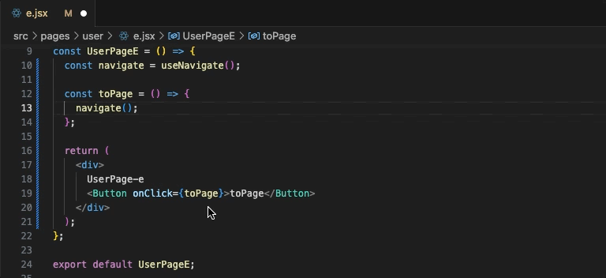
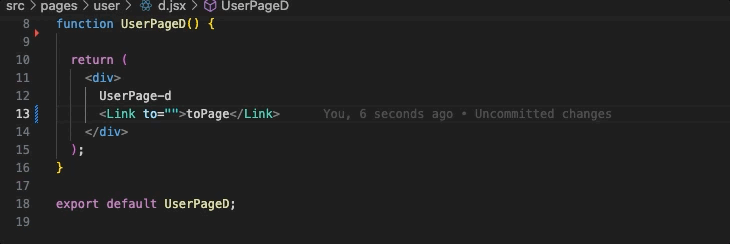

# sagaroute-vscode

 

**❗注意: 在`vscode extension marketplace`中该文档会存在图片和链接不能查看的情况，请前往[github](https://github.com/Hitotsubashi/sagaroute/tree/main/packages/vscode-ext)或[gitee](https://gitee.com/Hitotsubashi/sagaroute/tree/main/packages/vscode-ext)进行阅读**

## 介绍

`sagaroute-vscode`是一款约定式路由管理插件，除了**快速生成约定式路由**，还支持在编码过程中对路由的**智能提示**、**快速定位**、**诊断**、**高亮显示**等功能。运行效果可看以下展示：

<p align="center">
    
    <div align="center">文件变化后触发约定式路由的更新</div>
</p>

<p align="center">
    
    <div align="center">支持路由的样式高亮、智能提示、悬浮显示和点击跳转到路由对应组件</div>
</p>

<p align="center">
    
    <div align="center">支持对路由的诊断，不匹配的路由将以警告显示</div>
</p>

## 特点

<!-- TODO以下功能新增链接 -->

- 🌴 泛用性: 生成的**约定式路由列表**遵循`ES6 Module`格式，适用于任何开发环境
- 🔖 [智能提示](./doc/Advanced.md#路由智能提示): 在填写路由参数处会冒出路由选择项，在选择项中可查看该路由对应的组件文件信息
- 🎯 精准定位: 可通过[点击路由](./doc/Advanced.md#路由跳转)和[解析`url`跳转](./doc/Advanced.md#通过url定位路由文件)到路由对应的组件文件
- 📇 [路由诊断](./doc/Advanced.md#路由诊断): 支持对路由进行检测，不匹配的路由将以警告显示

## 使用

### 1. 安装插件

从`vscode`的`EXTENSTIONS: MARKETPLACE`中下载，如下所示👇：

<p align="center">
    
</p>

下载`sagaroute-vscode`后会发现`Vscode`右下角的状态栏出现了一个如下的控件：

<p align="center">
    
    <div align="center">此时代表Sagaroute没有开启监听</div>
</p>

`sagaroute-vscode`在每个项目中是默认不开启监听工作的，需要开发者手动点击上面 👆 的控件切换监听状态，当开启监听后控件会如下所示

<p align="center">
    
    <div align="center">此时代表Sagaroute已开启监听</div>
</p>

### 2. 在路由模板文件中用注释做标记注入

[**路由模板文件**](../react/doc/Template.md)是指要被注入路由列表的文件，我们需要通过注释来指明**路由模板文件**中哪个位置被注入**路由列表**和**依赖**

例如存在**路由模板文件**，其内容如下：

```js
import React from 'react';

const routes = [];
const router = createBrowserRouter(routes);
export default router;
```

我们需要对上述文件用注释进行标记，标记后如下所示：

```js
import React from 'react';
import { createBrowserRouter } from 'react-router-dom';
/* sagaroute-inject:imports */

/* sagaroute-inject:routes */
const routes = [];
const router = createBrowserRouter(routes);
export default router;
```

其中`/* sagaroute-inject:imports */`用于标记**依赖**注入的位置，`/* sagaroute-inject:routes */`用于标记**路由列表**注入的位置。关于这些注释的含义和**路由模板文件**的更多说明可看[此处](../react/doc/Routing.md)

### 3. 生成路由列表

`sagaroute-vscode`会监听**页面文件目录**里的文件，当更改的文件`CRTL+S`保存时开始执行生成路由，同时你也可以使用命令要求本插件开始生成路由，即(CMD/CTRL + Shift + P)唤出命令面板后输入`Sagaroute: routing`，如下 👇 所示：

<p align="center">
    
</p>

## 支持设置路由属性

你可以在组件的[`routeProps`](../react/doc/Routing.md#routeprops)字段中设置属性，`routeProps`上的所有属性会复制到**注册路由**上：

假如存在`src/pages/users.tsx`文件，其文件内容如下所示：

```jsx
import ErrorBoundary from '@/components/ErrorBoundary';

export default function Users() {
  return <div>Users...</div>;
}

// 设置routeProps
/** @type {import('react-router-dom').RouteObject} */
Users.routeProps = {
  caseSensitive: false,
  ErrorBoundary: ErrorBoundary,
};
```

生成的注册路由如下所示：

```jsx
{
  path:'user',
  element:<PagesUsers/>,
  caseSensitive: false,
  ErrorBoundary: ComponentsErrorBoundary
}
```

可看以下效果图：


`routeProps`属性的设置值支持任意类型，不过要遵循编码规则，详情请看[此处](../react/doc/Routing.md#routeprops)

## 配置参数

`sagaroute`中支持指定的配置项如下所示：

配置项中所有参数的简要说明如下所示：

| 名称 | 说明 | 类型 | 默认值 |
| --- | --- | --- | --- |
| [dirpath](../react/doc/API.md#dirpath) | **页面文件目录**路径 | string | 'src/pages' |
| [layoutDirPath](../react/doc/API.md#layoutdirpath) | 全局路由目录路径 | string | 'src/layouts' |
| [routeFilePath](../react/doc/API.md#routeFilePath) | 指定路由模板文件的路径 | string | 'src/route.tsx' |
| [lazy](../react/doc/API.md#lazy) | 路由是否懒加载 | boolean/Function(string): boolean | false |
| [hooks](../react/doc/API.md#hooks) | 执行周期的钩子函数 | object | -- |
| [pathRewrite](../react/doc/API.md#pathRewrite) | 用于对 import 语句的路径进行替换 | Object{string: string} | -- |
| [rootPath](../react/doc/API.md#rootPath) | 项目路径 | string | process.cwd() |
| [onWarning](./doc/API.md#onwarning) | 触发警告时的回调函数 | function(message: string): void | -- |

**注意❗：在该插件中，`hooks`的[`print.write.after`](../react/doc/Hook.md#printwriteafter)不会被执行。**

对上述配置参数中更详细的说明可看[API](../react/doc/API.md)

### 配置设置方式

往项目中添加`sagaroute.config.js`或`sagaroute.config.cjs`作为配置文件，在文件中以`CommonJS`的格式编写和导出部分上述[配置项](#配置参数)，例如：

```js
/** @type {import('@sagaroute/react').RoutingOption} */
module.exports = {
  // 指定页面文件目录
  dirpath: 'src/views',
  // 指定路由模板文件
  routeFilePath: 'src/router/index.jsx',
};
```

## 命令

`sagaroute-vscode`提供了以下命令，可通过(CMD/CTRL + Shift + P)唤出命令面板后输入使用：

- `Sagaroute: routing`: 生成路由列表，若存在缓存，则无视缓存重新构建
- `Sagaroute: rebuild`: 重新根据[配置文件](#配置设置方式)构建配置，并执行生成路由列表的操作
- `Sagaroute: show`: 打开`sagaroute-vscode`的`output`输出面板
- `Sagaroute: parse`: 用于根据`url`快速定位文件，详情请看[高级特性-通过url快速定位文件](./doc/Advanced.md#通过url定位路由文件)

## `.vscode/settings.json`中的设置

1. `sagaroute.working`: 决定`sagaroute-vscode`是否开启监听**路由文件目录**的变化以动态生成约定式路由列表，如下所示：

   ```js
   {
     // true代表开启监控
     "sagaroute.working": true
   }
   ```

2. `sagaroute.decoration`: 决定路由高亮的样式，详细可看[路由高亮](./doc/Advanced.md#路由高亮)

## 状态栏

在`vscode`底部的状态栏中会有`sagaroute-vscode`的状态控件，以显示`sagaroute-vscode`是否处于监听**路由文件目录**中。如下所示：

<p align="center">
    
    <div align="center">白字代表sagaroute-vscode没有监听</div>
</p>

<p align="center">
    
    <div align="center">绿字代表sagaroute-vscode正在监听</div>
</p>

你也可以通过点击该状态控件来切换监听状态。监听状态会同步到`.vscode/settings.json`的`sagaroute.working`变量中

## 常见问题🤔️

### 支持生成懒加载的路由吗？

答：是的。`sagaroute-vscode`支持批量生成`lazy`路由

[`lazy`](https://reactrouter.com/en/main/route/lazy#lazy)是`react-router@6.4`新增的路由属性，用于路由文件的懒加载，`lazy`有多种写法，如下所示：

```js
[
  // 写法1: 只对路由文件进行懒加载
  {
    path: 'projects',
    loader: ({ request }) => fetchDataForUrl(request.url),
    lazy: () => import('./projects'),
  },
  // 写法2: 对路由文件及其路由属性变量进行懒加载
  {
    path: 'messages',
    async lazy() {
      let { messagesLoader, Messages } = await import('./pages/Dashboard');
      return {
        loader: messagesLoader,
        Component: Messages,
      };
    },
  },
];
```

本插件可以通过设置[`lazy`配置项](https://gitee.com/Hitotsubashi/sagaroute/blob/main/packages/react/doc/API.md#lazy)统一生成上述 👆 第 2 种写法的`lazy`路由，如下 👇 效果图：


### 每次文件内容的变动都会触发路由列表的更新吗？

答：不一定。

本插件内部实现了路由对象的缓存机制，因此存在以下优点：

1. 加速二次生成路由的速度：对内容未更改的文件会直接取缓存作为生成结果，加快生成整个路由列表的生成速度
2. 只在路由列表变化时更新文件：对每个非缓存的新路由，会与缓存中的路由进行对比，如果所有对比结果与上次相同且没有增删的路由，则不会更改文件内容，避免频繁的热更新

可看以下👇效果图：

<p align="center">
  
  <div align="center">1. 生成路由与上次一致时，不会更改路由文件的内容</div>
</p>

<p align="center">
  
  <div align="center">2. 生成路由与上次不一致时，才会更改路由文件的内容</div>
</p>

若要无视缓存强制生成路由列表，则可使用[`Sagaroute: routing`命令](#命令)
