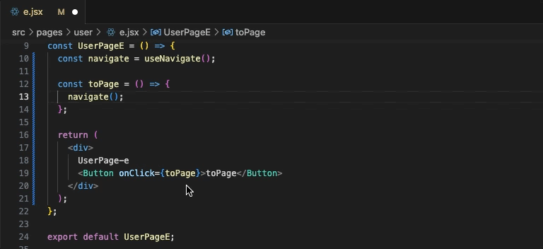
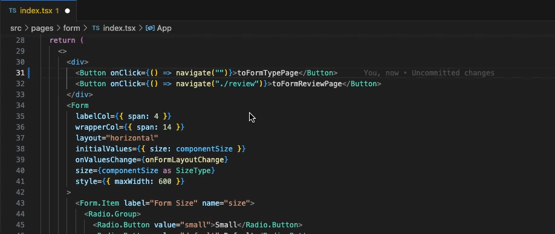
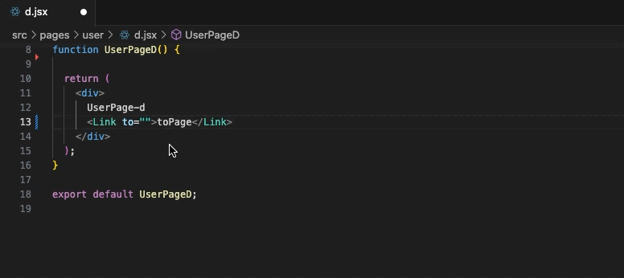

# 高级特性

## 路由智能提示

`sagaroute-vscode`会对`react-router`提供的`API`中需要传入路由字符串的形参处提供路由可选项，例如`<Link/>`和`<Navigate/>`的`to`参数、`useHref`和`useLinkClickHandler`的第一形参等。路由可选项会在用户键入`/`后弹出。如下👇所示：



在路由可选项的右侧会提供提供以下信息：

1. 该路由对应的组件文件路径
2. 该路由对应的组件的注释信息（如果存在则显示，否则不显示）

---

除此之外，`sagaroute-vscode`还支持**相对路径**的路由智能提示。假设有以下场景：

当前项目的路由列表如下所示：

```jsx
[
  {
    path: 'form',
    children: [
      {
        path: ':type',
        element: <PagesFormType />,
      },
      {
        index: true,
        element: <PagesFormIndex />,
      },
      {
        path: 'review',
        element: <PagesFormReview />,
      },
    ],
  },
  // 其余路由对象省略...
];
```

当我们在上述路由列表中的`<PagesFormIndex />`组件对应的文件进行编码且使用相对路径时，会有以下效果👇：



从上述效果可看出：

1. 当键入`./`时，会给予当前文件对应的路由(`/form`)去提供路由可选项，此时出现`:type`和`review`两个可选值
2. 当键入`../`时，结合当前文件对应的路由(`/form`)算出此时路由为`/`，即根路径，此时出现的路由可选值为整个路由列表

## 路由诊断

`sagaroute-vscode`会对`react-router`提供的`API`（如`Link`、`Navigate`、`useHref`等）中传入路由字符串的形参处进行路由诊断，所谓路由诊断就是查看路由字符串是否匹配路由列表中的路由，如果不匹配，`sagaroute-vscode`会对该路由字符串标黄警告显示，如下所示：



从上述效果可知，路由诊断对相对路径和绝对路径的路由都会进行诊断

<!-- TODO:注释禁止 -->
