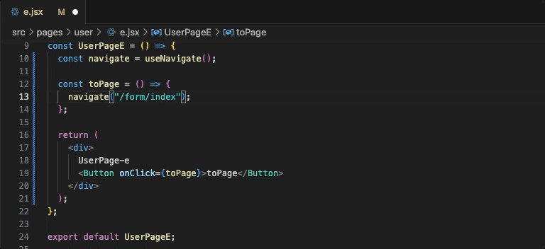
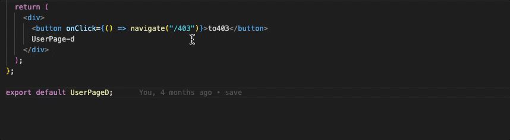
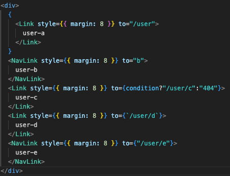
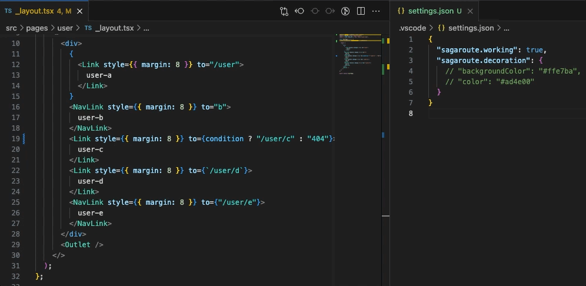

# 高级特性

## 路由智能提示

`sagaroute-vscode`会对`react-router`提供的`API`中需要传入路由字符串的形参处提供路由可选项，例如`<Link/>`和`<Navigate/>`的`to`参数、`useHref`和`useLinkClickHandler`的第一形参等。路由可选项会在用户键入`/`后弹出。如下👇所示：


在路由可选项的右侧会提供提供以下信息：

1. 该路由对应的组件文件路径
2. 该路由对应的组件的注释信息（如果存在则显示，否则不显示）

---

除此之外，`sagaroute-vscode`还支持**相对路径**的路由智能提示。假设有以下场景：

当前项目的路由列表如下所示：

```jsx
[
  {
    path: 'form',
    children: [
      {
        path: ':type',
        element: <PagesFormType />,
      },
      {
        index: true,
        element: <PagesFormIndex />,
      },
      {
        path: 'review',
        element: <PagesFormReview />,
      },
    ],
  },
  // 其余路由对象省略...
];
```

当我们在上述路由列表中的`<PagesFormIndex />`组件对应的文件进行编码且使用相对路径时，会有以下效果👇：


从上述效果可看出：

1. 当键入`./`时，会给予当前文件对应的路由(`/form`)去提供路由可选项，此时出现`:type`和`review`两个可选值
2. 当键入`../`时，结合当前文件对应的路由(`/form`)算出此时路由为`/`，即根路径，此时出现的路由可选值为整个路由列表

## 路由诊断

`sagaroute-vscode`会对`react-router`提供的`API`（如`Link`、`Navigate`、`useHref`等）中传入路由字符串的形参处进行路由诊断，所谓路由诊断就是查看路由字符串是否匹配路由列表中的路由，如果不匹配，`sagaroute-vscode`会对该路由字符串标黄警告显示，如下所示：


从上述效果可知，路由诊断对相对路径和绝对路径的路由都会进行诊断。

**注意❗：`sagaroute-vscode`不会对带变量的模板字符串作诊断**，例如：

```js
// 不会诊断，因为无法判断其中的变量的值
navigate(`/form/${params}`);
// 会诊断，因为是常量
navigate(`/form/review`);
```

如果用户想手动禁止路由诊断，可通过添加`sagaroute-vscode`提供的以下两种注释内容去禁止：

1.  `sagaroute-ignore-next-line`: 禁止该注释的下一行代码的路由诊断，例如：

    ```jsx
    function() {
        const navigate = useNavigate();
        /* sagaroute-ignore-next-line */
        const toPage = () => { navigate("/form/index"); };//此处不会进行代码诊断

        return (
            <div>
                UserPage-d
                {
                    // sagaroute-ignore-next-line
                    <Link to="../b1">toPage</Link> //此处不会进行代码诊断
                }
            </div>
        );
    }
    ```

2.  `sagaroute-ignore`: 禁止对该注释下的文件内容进行路由诊断

## 路由跳转

`sagaroute-vscode`会对`react-router`提供的`API`（如`Link`、`Navigate`、`useHref`等）中传入路由字符串的形参处提供路由跳转功能。当`ctrl`+`鼠标点击`该路由字符串，而该路由字符串有可以匹配路由列表中的路由时，`sagaroute-vscode`会跳转到该路由字符串对应的文件页面上，如下所示：



**注意❗：路由跳转对相对路径和绝对路径都生效，但对带变量的模板字符串不生效**，例如：

```js
// 不会跳转，因为无法判断其中的变量的值
navigate(`/form/${params}`);
```

## 路由悬浮显示组件信息

`sagaroute-vscode`会对`react-router`提供的`API`（如`Link`、`Navigate`、`useHref`等）中传入路由字符串的形参处提供查看组件信息功能。当鼠标悬浮到该路由字符串，而该路由字符串有可以匹配路由列表中的路由时，`sagaroute-vscode`会冒泡呈现该路由组件的信息，如下所示：



悬浮内容会提供以下信息：

1. 该路由对应的组件文件路径
2. 该路由对应的组件的注释信息（如果存在则显示，否则不显示）

**注意❗：路由跳转对相对路径和绝对路径都生效，但对带变量的模板字符串不生效**，例如：

```js
// 不会冒泡显示，因为无法判断其中的变量的值
navigate(`/form/${params}`);
```

## 通过url定位路由文件

可通过`Sagaroute: parse`指令唤出输入框，在输入框中输入要定位的`url`，`sagaroute-vscode`会解析`url`并在编辑窗口中打开该`url`对应的文件，如下效果图所示：


开发者无须关心`url`对应的路由模式是`hash`还是`browser`，`sagaroute-vscode`会自行判断处理

**注意❗: 在`vscode`项目首次打开时，要先做保存操作或者强制`Sagaroute: routing`触发路由列表刷新后，才会有开启快捷选择路由路径**

## 路由高亮

`sagaroute-vscode`会对`react-router`提供的`API`（如`Link`、`Navigate`、`useHref`等）中传入路由字符串的形参处进行高亮显示，如下所示：



用户也可以自定义路由的高亮样式，在`.vscode/settings.json`中，提供了`sagaroute.decoration`去设置高亮样式，如下所示：

```json
{
  "sagaroute.decoration": {
    "color": "#ad4e00", // 路由字体颜色
    "backgroundColor": "#ffe7ba" // 路由背景颜色
  }
}
```

效果如下所示：



**注意❗：路由跳转对对带变量的模板字符串不生效**
